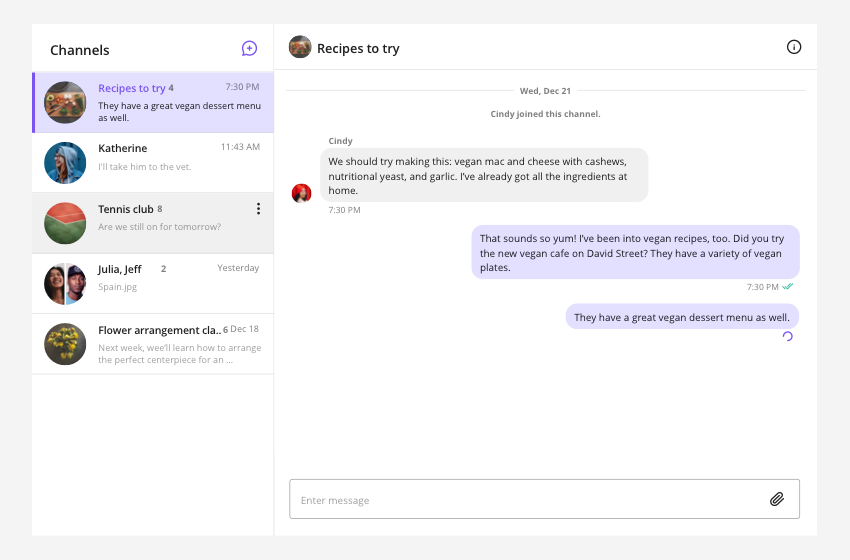

# Sendbird JavaScript samples


[](https://www.npmjs.com/package/sendbird)

Sendbird provides an easy-to-use Chat API, native Chat SDKs, UIKits, and a fully-managed chat platform on the backend that provides delivery receipts, offline messaging, presence, translation, moderation tools, and analytics.

The best way to get started is through the [JavaScript Getting Started guide](https://sendbird.com/docs/chat/v3/javascript/getting-started/about-chat-sdk).

## Introduction

This repository contains samples for how to use Sendbird to add chat using Javascript, React and React Native. You can find more information  in the [Javascript SDK documentation](https://sendbird.com/docs/chat/v3/javascript/getting-started/about-chat-sdk) and [React Quickstart Documentation](https://sendbird.com/docs/uikit/v1/react/quickstart/send-first-message)



### React
Sendbird UIKit for React is a set of prebuilt UI components that allows you to easily craft an in-app chat with all the essential messaging features. Our development kit includes light and dark themes, text fonts, colors and more. All the included components can be styled and customized to create an unique experience that fits your app.

- [**Basic React App**](https://github.com/sendbird/SendBird-JavaScript/tree/master/react/react-app-simple) is a quickest way to get started using UIKit

- [**Composed React App**](https://github.com/sendbird/SendBird-JavaScript/tree/master/react/react-app-custom) demonstrates how to use the various smart components.

- [**Custom React App**](https://github.com/sendbird/SendBird-JavaScript/tree/master/react/react-app-custom) shows how to customize the **Message**, **ChannelPreview**, and **UserList** UI elements.


### React Native
The Sendbird React Native framework allows you to simplify development for iOS and Android apps, and reuse the same code on both web and mobile apps.

- [**React native Redux**](https://github.com/sendbird/SendBird-JavaScript/tree/master/react-native/react-native-redux) shows how to use Sendbird with React Native on iOS and Android.

- [**React native Redux Syncmanager**](https://github.com/sendbird/SendBird-JavaScript/tree/master/react-native/react-native-redux-syncmanager) Expands on the above sample and implements the [Sendbird SyncManager](https://github.com/sendbird/sendbird-syncmanager-javascript)

- [**React Native Hooks**](https://github.com/sendbird/SendBird-JavaScript/tree/master/react-native/react-native-hook) Implements Sendbird on iOS and Android using the hooks pattern.


### JavaScript

- [**JavaScript chat sample**](https://github.com/sendbird/SendBird-JavaScript/tree/master/javascript/javascript-basic) is a Slack-like full screen chat sample for desktop browsers using both Group channels and open channels.

- [**JavaScript widget sample**](https://github.com/sendbird/SendBird-JavaScript/tree/master/javascript/javascript-widget) is a Facebook-chat-like chat widget for websites.
 
- [**JavaScript live chat sample**](https://github.com/sendbird/SendBird-JavaScript/tree/master/javascript/javascript-live-chat) is a Twitch-chat-like experience.

- [**JavaScript chat sample with SyncManager**](https://github.com/sendbird/sendbird-javascript-samples/tree/master/javascript/javascript-basic-syncmanager) is a web chat sample integrated with [Sendbird SyncManager document](https://sendbird.com/docs/syncmanager/v1/javascript/getting-started/about-syncmanager), adds local caching to the core chat features. For faster data loading and caching, the sample synchronizes with the Sendbird server and saves a list of group channels and the messages within the local cache into your client app.

## Installation

To use the Sendbird Chat SDK directly you can install it through npm or yarn with

```bash
npm install --save sendbird
```
or

```bash
yarn install --save sendbird
```

Or download the latest release manually from [GitHub](https://github.com/sendbird/SendBird-SDK-JavaScript)


## Getting Help

Check out the [UIKit for React docs](https://sendbird.com/docs/uikit/v1/javascript/getting-started/about-uikit). and Sendbird's [Developer Portal](https://sendbird.com/developer) for tutorials and videos. If you need any help in resolving any issues or have questions, visit our [community forums](https://community.sendbird.com/c/sendbird-chat/12).

## We are Hiring!
Sendbird is made up of a diverse group of humble, friendly, and hardworking individuals united by a shared purpose to build the next generation of mobile & social technologies. Join our team remotely or at one of our locations in San Mateo, Seoul, New York, London, and Singapore. More information on a [careers page](https://sendbird.com/careers).
